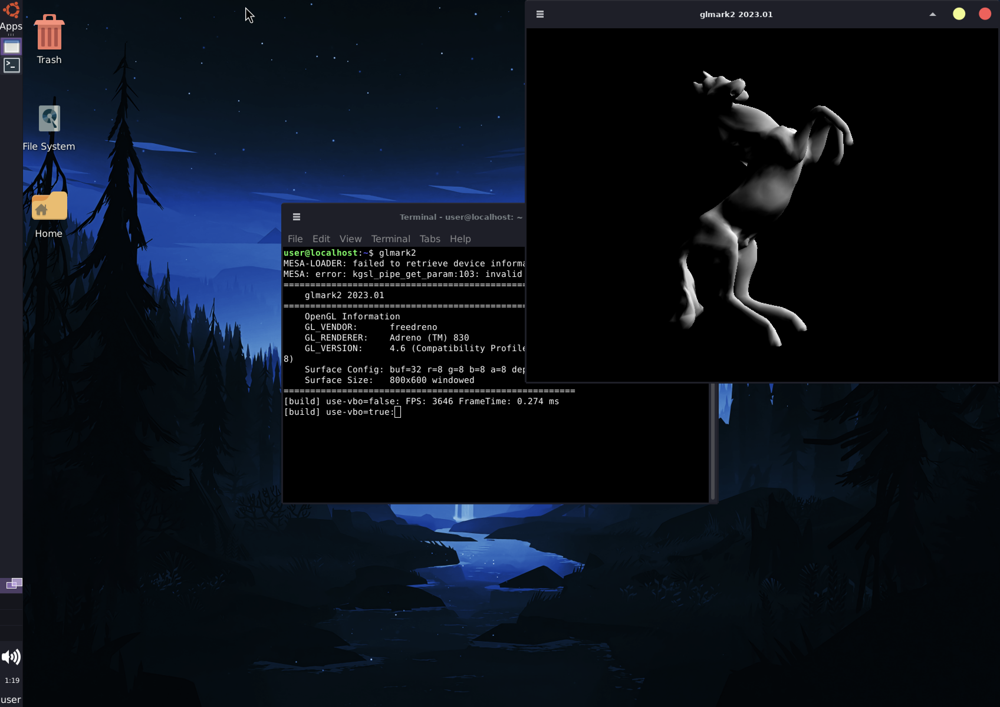

# Chroot_Ubuntu (ROOT REQUIRED!)
A chroot for Android devices with turnip drivers specifically tested for Snapdragon 8 Elite

Known working CPUS so far:
Snapdragon 8 Elite
Snapdragon 870

please let me know if you tested under a snapdragon cpu so I can add it to the list


## This ROOTFS contains:
Ubuntu 24.04

XFCE4

Dark mode Hi dpi themes

Some Wallpapers that will rotate every 10 minutes

Mesa Delevel 26.2 Turnip from: https://github.com/lfdevs/mesa-for-android-container

User created named "user" with password set as "root"

Firefox-esr is installed

Box64-Android is installed

wine-staging_11.11~resolute-1_amd64 is installed




## Download and run install script
```bash
apt update
apt upgrade
apt install curl
curl -L -o install_ubuntu_chroot.sh \
  https://raw.githubusercontent.com/Dr4kzor/Chroot_Ubuntu/main/install_ubuntu_chroot.sh
chmod +x install_ubuntu_chroot.sh
./install_ubuntu_chroot.sh

```


## Download Uninstall Script
```bash
apt update
apt upgrade
apt install curl
curl -L -o uninstalllll_ubuntu_chroot.sh \
  https://raw.githubusercontent.com/Dr4kzor/Chroot_Ubuntu/main/uninstal_ubuntu_chroot.sh
chmod +x uninstall_ubuntu_chroot.sh

```


# IMPORTANT!
## Download and install Termux-X11 (Mandatory)
https://github.com/termux/termux-x11
## Set Termux-X11 display scale to 200%

## Download and install Termux-Widget (Optional) makes it possible to add scripts with icons to homescreen
https://github.com/termux/termux-widget
And for the icons to work you need to grant permissions to termux to display over apps
(In LineageOS icons work as a 1x1 icon, in OxigenOS termux-widget can only add a list instead of individual icons)

## If using KernelSU or KernelSU-NEXT you must manually set termux to root!
if you manually installed sudo in termux, remove it and replace it for tsu. This tsu package works with magisk and KernelSU variations (it provides sudo)

### Available shortcuts:

Start Ubuntu

Safe Mode (no android binds and root user as CMD)

Save a snapshot of your system (Logout first!)

Load Ubuntu from the default snapshot name in termux home dir

Refresh rate changes, setting minimum and maximum


# If you want to rename Default user:

1 - If you want to rename the default user as well as change its default password ("root") you should follow the next steps

2 - After Ubuntu load script finishes run "./.shortcuts/2-safe_mode.sh" (This can also be used as a way to login as root without any android mounts)

3 - While in Safe Mode run the script "rename_user.sh" present in home folder of root user

4 - After your user has been renamed now you must manually edit the launch script indicating the new username.
While in termux as a normal user  run "nano .shortcuts/1-ubuntu.sh"

Edit the following line: "export DEFINED_USERNAME=user"

Replace user with the exact new user name you just defined in the rename script

Press Ctrl + X to save it under the same name as before.

For a quick test you can run "./.shortcuts/1-ubuntu.sh" and check that everything works


## To run SU command:
If you want to use the cmd "su" you must run "sudo su" instead of just "su"


# You can save and load a snapshot of your container.
## Load snapshot
To Load a Snapshot of the container first run: "./.shortcuts/4-load_ubuntu_snapshot.sh" script (This will install dependencies create /data/local/ubuntu and move all file inside this folder)


## Save snapshot
run the script run "./.shortcuts/3-save_ubuntu_snapshot.sh" this will create a new backup in termux home dir and rename the older one into the same folder.


## How to update Mesa
run "./.shortcuts/2-safe_mode.sh"
run "./update_mesa.sh"


## Important mention.
Snapdragon 8 Elite has no 32 bit cores, so box86 does not work as it translates X86 to arm32. It is still possible to run 32 bit apps with FEX.

To download and install FEX please visite https://github.com/FEX-Emu/FEX/tree/main and follow their instructions. The installer will complete and throw 1 erro, however it will install and run successfully (still have to follow the instructions and download a rootfs for fex).


