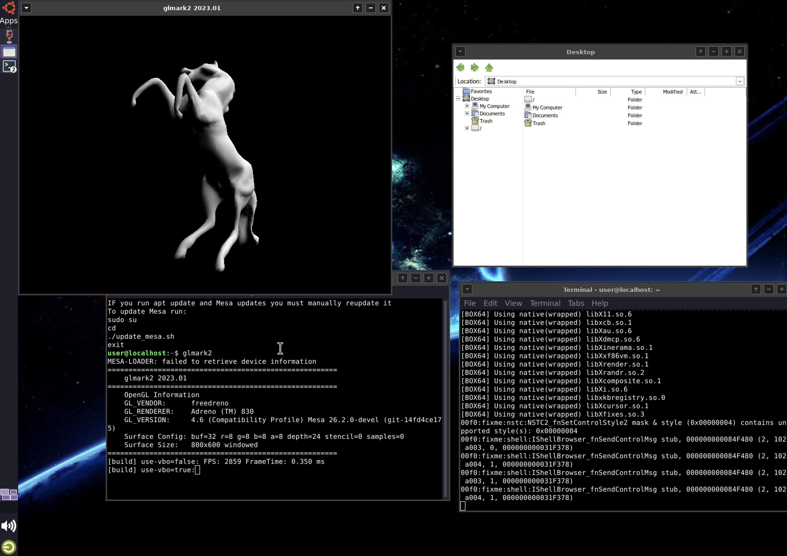

# There are 2 CHROOTS available that you can install and test at the same time (no conflit between their configs)

## (1) - CHROOT TERMUX-X11 with XFCE4 (battle tested and extremely stable but slower)
Here we use half the native screen resolution and glmark2 yields 2500 FPS to 3000 FPS

## (2) - CHROOT ANland with KDE (more recent but only tested for 2 days so far, no crashes or issues detected so far)
Here we use full native screen resolution and glmark2 yields 4300 FPS to 5500 FPS (you can reach 6000 FPS if you run apps directly avoiding using KDE)


## (1) TERMUX-X11 with XFCE4 preview (Half native screen resolution)


## (2) ANLand with KDE preview (Full native screen resolution)


# Chroot_Ubuntu (ROOT REQUIRED!)
A chroot for Android devices with turnip drivers specifically tested for Snapdragon 8 Elite

Known working CPUS so far:
Snapdragon 8 Elite
Snapdragon 870

please let me know if you tested under a snapdragon cpu so I can add it to the list


## (1) - TERMUX-X11 This ROOTFS contains:
Ubuntu 24.04

XFCE4

Dark mode Hi dpi themes

Some Wallpapers that will rotate every 10 minutes

Mesa Delevel 26.2 Turnip from: https://github.com/lfdevs/mesa-for-android-container

User created named "user" with password set as "root"

Firefox-esr is installed

Box64-Android is installed

wine-staging_11.12~resolute-1_amd64 is installed


## (1) - TERMUX-X11 Download and run install script
```bash
apt update
apt upgrade
apt install curl
curl -L -o install_ubuntu_chroot.sh \
  https://raw.githubusercontent.com/Dr4kzor/Chroot_Ubuntu/main/install_ubuntu_chroot.sh
chmod +x install_ubuntu_chroot.sh
./install_ubuntu_chroot.sh

```


## (1) - TERMUX-X11 Download Uninstall Script
```bash
apt update
apt upgrade
apt install curl
curl -L -o uninstall_ubuntu_chroot.sh \
  https://raw.githubusercontent.com/Dr4kzor/Chroot_Ubuntu/main/unistall_ubuntu_chroot.sh
chmod +x uninstall_ubuntu_chroot.sh

```


# (1) - TERMUX-X11 IMPORTANT!
## (1) - TERMUX-X11  Download and install Termux-X11 (Mandatory)
https://github.com/termux/termux-x11
## (1) - TERMUX-X11  Set Termux-X11 display scale to 200%

## (1) - TERMUX-X11  Download and install Termux-Widget (Optional) makes it possible to add scripts with icons to homescreen
https://github.com/termux/termux-widget
And for the icons to work you need to grant permissions to termux to display over apps
(In LineageOS icons work as a 1x1 icon, in OxigenOS termux-widget can only add a list instead of individual icons)

## (1) - TERMUX-X11  If using KernelSU or KernelSU-NEXT you must manually set termux to root!
if you manually installed sudo in termux, remove it and replace it for tsu. This tsu package works with magisk and KernelSU variations (it provides sudo)

### (1) - TERMUX-X11  Available shortcuts:

Start Ubuntu

Safe Mode (no android binds and root user as CMD)

Save a snapshot of your system (Logout first!)

Load Ubuntu from the default snapshot name in termux home dir

Refresh rate changes, setting minimum and maximum


# (1) - TERMUX-X11  If you want to rename Default user:

1 - If you want to rename the default user as well as change its default password ("root") you should follow the next steps

2 - After Ubuntu load script finishes run "./.shortcuts/2-safe_mode.sh" (This can also be used as a way to login as root without any android mounts)

3 - While in Safe Mode run the script "rename_user.sh" present in home folder of root user

4 - After your user has been renamed now you must manually edit the launch script indicating the new username.
While in termux as a normal user  run "nano .shortcuts/1-ubuntu.sh"

Edit the following line: "export DEFINED_USERNAME=user"

Replace user with the exact new user name you just defined in the rename script

Press Ctrl + X to save it under the same name as before.

For a quick test you can run "./.shortcuts/1-ubuntu.sh" and check that everything works


# (1) - TERMUX-X11  You can save and load a snapshot of your container.
## (1) - TERMUX-X11  Load snapshot
To Load a Snapshot of the container first run: "./.shortcuts/4-load_ubuntu_snapshot.sh" script (This will install dependencies create /data/local/ubuntu and move all file inside this folder)


## (1) - TERMUX-X11  Save snapshot
run the script run "./.shortcuts/3-save_ubuntu_snapshot.sh" this will create a new backup in termux home dir and rename the older one into the same folder.


## (1) - TERMUX-X11  How to update Mesa
run "./.shortcuts/2-safe_mode.sh"
run "./update_mesa.sh"


## (2) - ANland KDE is around 2X faster rendering frames even at 2X resolution meaning it may have more iddle time in the GPU and CPU allowing for more batterie life

## (2) - ANland Download and run install script
```bash
apt update
apt upgrade
apt install curl
curl -L -o install_ubuntu_chroot.sh \
  https://raw.githubusercontent.com/Dr4kzor/Chroot_Ubuntu/main/install_ubuntu_anland.sh
chmod +x install_ubuntu_chroot.sh
./install_ubuntu_anland.sh

```


## (2) - ANland Download Uninstall Script
```bash
apt update
apt upgrade
apt install curl
curl -L -o uninstall_ubuntu_chroot.sh \
  https://raw.githubusercontent.com/Dr4kzor/Chroot_Ubuntu/main/uninstall-anland.sh
chmod +x uninstall-anland.sh

```

## (2) - ANland setup
Github repo: https://github.com/lfdevs/anland-termux
our install script tries to install both termux-x11 anland and Android anland automatically, if it fails you can manually download them and install them
after installation completes you can run anland_chroot inside termux to either: reinstall, update, update ANland apps, and uninstall.

# (2) - ANland
we also have shortcuts for saving and loading snapshots


## Important mention.
Snapdragon 8 Elite has no 32 bit cores, so box86 does not work as it translates X86 to arm32. It is still possible to run 32 bit apps with FEX.

To download and install FEX please visite https://github.com/FEX-Emu/FEX/tree/main and follow their instructions. The installer will complete and throw 1 erro, however it will install and run successfully (still have to follow the instructions and download a rootfs for fex).


## To run SU command:
If you want to use the cmd "su" you must run "sudo su" instead of just "su"

